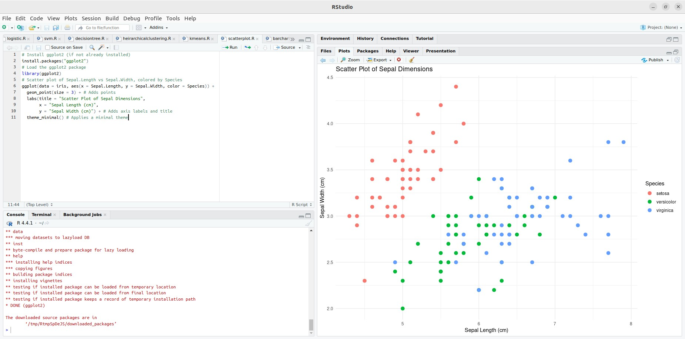
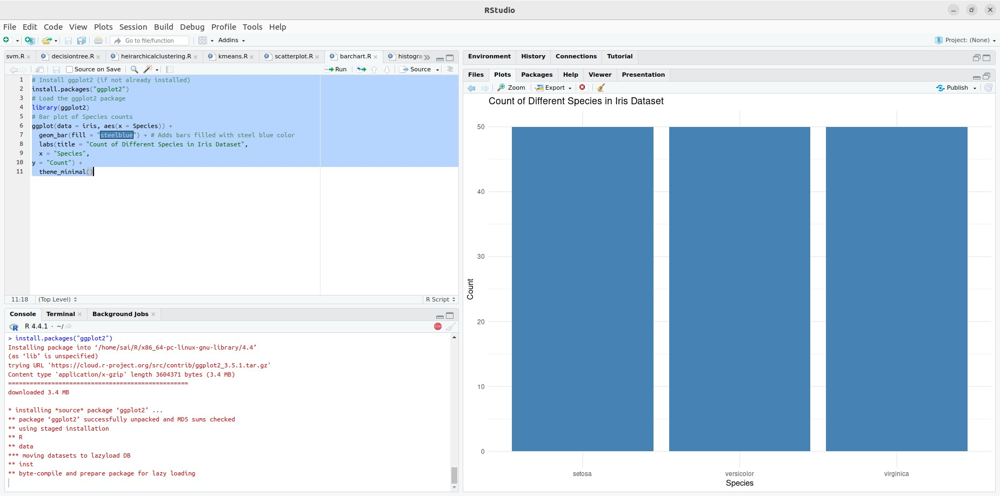
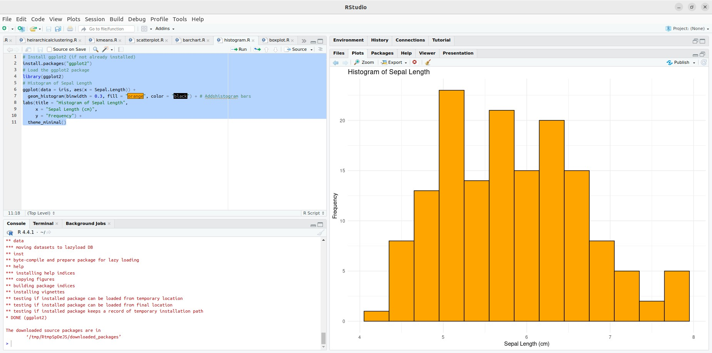
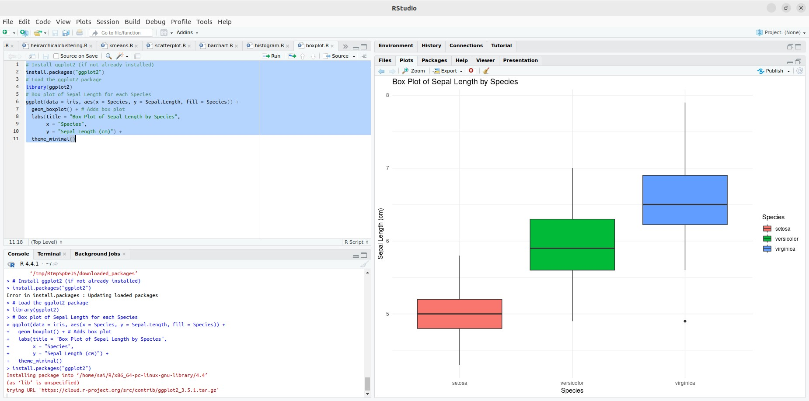

## Experiment 10: Visualizing Data with ggplot2 in R

### AIM:

This guide demonstrates how to visualize data using ggplot2, a powerful plotting framework within R. We'll explore creating various plot types: scatter plot, bar chart, histogram, and box plot.

### Procedure:

**1. Load ggplot2:**

```R
library(ggplot2)
```

**2. Load Data (assuming your data is in a DataFrame called `data`):**

```R
# Example: Load the iris dataset
data(iris)
```

**3. Explore the Data:**

Understand the data structure and identify variables for visualization.

**4. Choose a Plot Type:**

Select the appropriate ggplot2 function based on your data and desired plot:

* **Scatter Plot (px.scatter):** Visualizes relationships between two continuous variables.
* **Bar Chart (px.bar):** Represents categorical data with bars.
* **Histogram (geom_histogram):** Shows the distribution of a continuous variable.
* **Box Plot (geom_boxplot):** Displays distribution and outliers for a continuous variable across categories.

**5. Define Axes:**

Specify the DataFrame columns for the x and y axes in the `aes` function.

**6. Customize the Plot:**

* **Add titles and labels:** Use `labs` function.
* **Change color schemes:** Use `fill` and `color` aesthetics.
* **Adjust themes:** Use `theme_minimal` or other built-in themes for a clean look.

**7. Add Interactive Elements (Optional):**

* **Hover data:** Use tooltips to display information on mouse hover.
* **Facet plots:** Create multiple plots based on different categories.

**8. Render and Save (Optional):**

* **Display the plot:** Use `ggplot()` to create the plot and display it with `ggsave`.
* **Save the plot:** Use `ggsave` to save as an image or `htmlwidgets::saveWidget` for interactive plots.

**Example Code:**

**Scatter Plot:**

```R
ggplot(data = iris, aes(x = Sepal.Length, y = Sepal.Width, color = Species)) +
  geom_point(size = 3) +
  labs(title = "Scatter Plot of Sepal Dimensions",
       x = "Sepal Length (cm)",
       y = "Sepal Width (cm)") +
  theme_minimal()
```

**Bar Chart:**

```R
ggplot(data = iris, aes(x = Species)) +
  geom_bar(fill = "steelblue") +
  labs(title = "Count of Different Species in Iris Dataset",
       x = "Species",
       y = "Count") +
  theme_minimal()
```

**Histogram:**

```R
ggplot(data = iris, aes(x = Sepal.Length)) +
  geom_histogram(binwidth = 0.3, fill = "orange", color = "black") +
  labs(title = "Histogram of Sepal Length",
       x = "Sepal Length (cm)",
       y = "Frequency") +
  theme_minimal()
```

**Box Plot:**

```R
ggplot(data = iris, aes(x = Species, y = Sepal.Length, fill = Species)) +
  geom_boxplot() +
  labs(title = "Box Plot of Sepal Length by Species",
       x = "Species",
       y = "Sepal Length (cm)") +
  theme_minimal()
```

