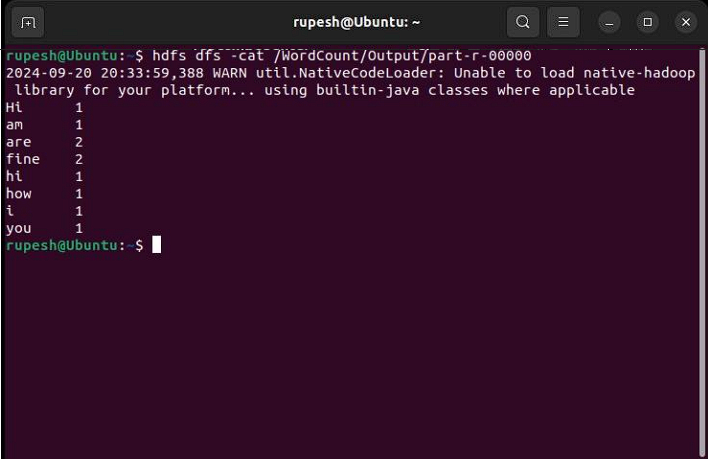

# Running a Basic Word Count MapReduce Program on Hadoop

This document outlines the steps involved in running a basic word count program using Hadoop's MapReduce framework. It serves as a practical introduction to the MapReduce paradigm.

## Objectives

- Understand the MapReduce processing model.
- Implement a simple Word Count program using Python.
- Run the program on a single-node Hadoop cluster.


## Procedure

### 1. Create Data File:

Start by creating a text file named `word_count_data.txt` containing sample text. Here's an example:

```
Hadoop is a framework that allows for distributed processing of large data sets.
```

### 2. Write the Mapper Program (`mapper.py`):

This Python script reads lines of text as input and emits each word as a key-value pair, where the value is 1 (representing the occurrence of the word).

```python
import sys

for line in sys.stdin:
    line = line.strip()
    words = line.split()
    for word in words:
        print(f"{word}\t1")
```

### 3. Write the Reducer Program (`reducer.py`):

The reducer aggregates the key-value pairs received from the mapper. It sums the occurrences of each unique word and outputs the word and its total count.

```python
import sys

current_word = None
current_count = 0
word = None

for line in sys.stdin:
    line = line.strip()
    word, count = line.split('\t', 1)
    try:
        count = int(count)
    except ValueError:
        continue

    if current_word == word:
        current_count += count
    else:
        if current_word:
            print(f"{current_word}\t{current_count}")
        current_count = count
        current_word = word

if current_word == word:
    print(f"{current_word}\t{current_count}")
```

### 4. Set Up Hadoop Environment:

Create an input directory in HDFS to store your data file:

```bash
hdfs dfs -mkdir /word_count_input
```

Upload the data file to the HDFS input directory:

```bash
hdfs dfs -copyFromLocal word_count_data.txt /word_count_input
```

### 5. Run the Word Count Program:

Use the `hadoop jar` command with the hadoop-streaming library to execute the MapReduce job:

```bash
hadoop jar $HADOOP_HOME/share/hadoop/tools/lib/hadoop-streaming-*.jar \
-input /word_count_input/word_count_data.txt \
-output /word_count_output \
-mapper mapper.py \
-reducer reducer.py
```

### 6. Verify the Output:

Use the `hdfs dfs -cat` command to view the results stored in the output directory:

```bash
hdfs dfs -cat /word_count_output/part-00000
```

