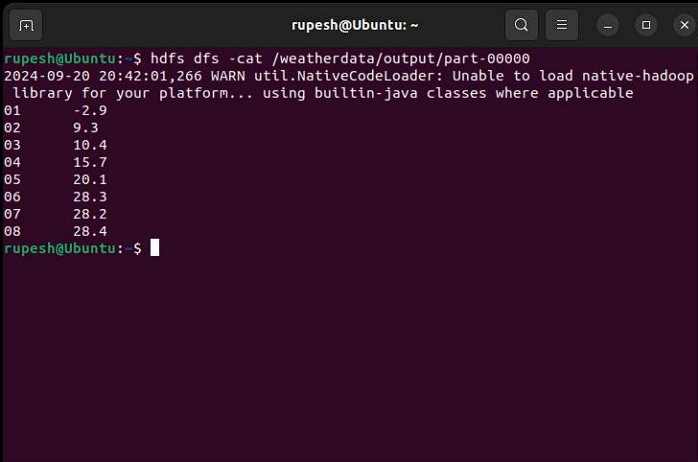

## Expt-3: MapReduce Program to Process a Weather Dataset

## AIM:

To implement a MapReduce program to process a weather dataset and find the maximum temperature for each month.

## PROCEDURE:

### 1. Create Weather Dataset:

```bash
nano weather_data.txt
```

**Example content:**

```
20220101 30.5
20220102 29.8
20220201 25.2
# ... (more data)
```

### 2. Mapper Program (mapper.py):

```python
#!/usr/bin/env python3
import sys

for line in sys.stdin:
  line = line.strip()
  month = line[4:6]  # Extracting month
  temp = line[7:11]  # Extracting temperature
  print(f'{month}\t{temp}')
```

This Python script extracts the month (characters 4-5) and temperature (characters 7-10) from each line in the input file. It then emits each month as a key and the temperature as a value.

### 3. Reducer Program (reducer.py):

```python
#!/usr/bin/env python3
import sys

current_month = None
current_max_temp = -float('inf')  # Initialize with negative infinity

for line in sys.stdin:
  line = line.strip()
  month, temp = line.split('\t')
  try:
    temp = float(temp)
  except ValueError:
    continue

  if current_month == month:
    current_max_temp = max(current_max_temp, temp)  # Find max temp for current month
  else:
    if current_month:
      print(f'{current_month}\t{current_max_temp}')  # Output previous month's max temp
    current_month = month
    current_max_temp = temp  # Reset for new month

if current_month == month:
  print(f'{current_month}\t{current_max_temp}')  # Output last month's max temp
```

This Python script iterates over the key-value pairs received from the mapper. It keeps track of the current month and the maximum temperature encountered so far for that month. It outputs the previous month's maximum temperature whenever it encounters a new month in the data. Finally, it outputs the last month's maximum temperature as well.

### 4. Run the Program:

```bash
hdfs dfs -mkdir /weatherdata
hdfs dfs -copyFromLocal weather_data.txt /weatherdata
hadoop jar $HADOOP_HOME/share/hadoop/tools/lib/hadoop-streaming-*.jar \
-input /weatherdata/weather_data.txt \
-output /weatherdata/output \
-mapper mapper.py \
-reducer reducer.py
```

### 5. Check Output:

```bash
hdfs dfs -cat /weatherdata/output/part-00000
```
