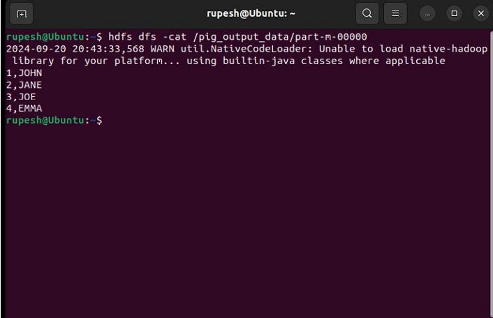

## Expt-4: Creating and Executing UDFs in Apache Pig (MapReduce/HDFS Mode)

### AIM:

This guide demonstrates how to create a User-Defined Function (UDF) in Apache Pig and execute it within a MapReduce/HDFS environment.

### Procedure:

**Step 1: Install and Configure Apache Pig**

1. **Download Apache Pig:**

   Visit the official Apache Pig website ([https://pig.apache.org/](https://pig.apache.org/)) and download the latest stable version. Here, we'll assume version 0.16.0:

   ```bash
   wget https://dlcdn.apache.org/pig/pig-0.16.0/pig-0.16.0.tar.gz
   ```

2. **Extract Pig:**

   ```bash
   tar xvzf pig-0.16.0.tar.gz
   ```

3. **Move Pig Directory:**

   Move the extracted Pig files to a dedicated directory:

   ```bash
   sudo mv pig-0.16.0 /usr/local/pig
   ```

4. **Set Environment Variables:**

   Edit your shell configuration file (e.g., `.bashrc`) to set up Pig environment variables:

   ```bash
   nano ~/.bashrc
   ```

   Append the following lines:

   ```
   export PIG_HOME=/usr/local/pig
   export PATH=$PATH:$PIG_HOME/bin
   export PIG_CLASSPATH=$HADOOP_HOME/conf
   ```

   **Apply the changes:**

   ```bash
   source ~/.bashrc
   ```

5. **Verify Pig Installation:**

   Run the following command to confirm successful Pig installation:

   ```bash
   pig -version
   ```

**Step 2: Create Sample Data for the Pig Job**

1. **Create a Sample Data File:**

   Create a text file named `sample.txt` containing some sample data:

   ```bash
   nano sample.txt
   ```

   Add the following content:

   ```
   1,John
   2,Jane
   3,Joe
   4,Emma
   ```

2. **Upload the Data File to HDFS:**

   Upload the sample file to HDFS using the `hdfs dfs` command:

   ```bash
   hdfs dfs -mkdir /piginput
   hdfs dfs -put sample.txt /piginput
   ```

**Step 3: Write a Pig Script for the UDF**

1. **Create the Pig Script:**

   Create a new Pig script named `demo_pig.pig`:

   ```bash
   nano demo_pig.pig
   ```

   Write the following code in the script to load and display the data:

   ```pig
   pig

   -- Load data from HDFS
   data = LOAD '/piginput/sample.txt' USING PigStorage(',') AS (id:int, name:chararray);

   -- Display the loaded data
   DUMP data;
   ```

**Step 4: Write the UDF in Python**

1. **Create the Python UDF:**

   Create a Python file named `uppercase_udf.py` to convert text to uppercase:

   ```bash
   nano uppercase_udf.py
   ```

   Add the following Python code:

   ```python
   def uppercase(text):
       return text.upper()

   if __name__ == "__main__":
       import sys
       for line in sys.stdin:
           line = line.strip()
           print(uppercase(line))
   ```

2. **Upload the Python UDF to HDFS:**

   Upload the UDF file to HDFS using `hdfs dfs`:

   ```bash
   hdfs dfs -mkdir /udfs
   hdfs dfs -put uppercase_udf.py /udfs
   ```

**Step 5: Update Pig Script to Use UDF**

1. **Modify the Pig Script:**

   Edit the `demo_pig.pig` script to register the UDF and process the data:

   ```bash
   nano demo_pig.pig
   ```

   Modify the script as follows:

   ```pig
   pig

   -- Register the Python UDF script
   REGISTER '/udfs/uppercase_udf.py' USING jython AS myudf;

   -- Load data from HDFS
   data = LOAD '/piginput/sample.txt' USING PigStorage(',') AS (id:int, name:chararray);

   -- Apply UDF to convert names to uppercase
   uppercased_data = FOREACH data GENERATE myudf.uppercase(name);

   -- Display the transformed data
   DUMP uppercased_


