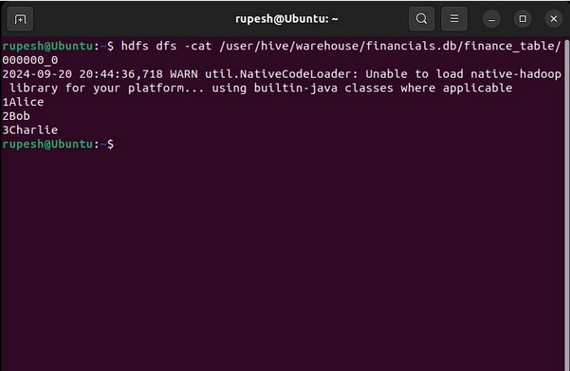

## Experiment 5: Creating and Querying Hive Tables

### AIM:

This guide demonstrates creating tables in Apache Hive and writing queries to access and manipulate stored data.

### Procedure:

**Step 1: Download and Install Hive**

1. **Download Hive:**

   Visit the official Apache Hive website ([https://hive.apache.org/general/downloads/](https://hive.apache.org/general/downloads/)) and download the latest stable version. Here, we'll assume version 3.1.2:

   ```bash
   wget https://downloads.apache.org/hive/hive-3.1.2/apache-hive-3.1.2-bin.tar.gz
   ```

2. **Extract Hive:**

   ```bash
   tar -xvf apache-hive-3.1.2-bin.tar.gz
   ```

3. **Move Hive Directory:**

   Move the extracted Hive files to a dedicated directory:

   ```bash
   sudo mv apache-hive-3.1.2-bin /usr/local/hive
   ```

4. **Set Hive Environment Variables:**

   Edit your shell configuration file (e.g., `.bashrc`) to set up Hive environment variables:

   ```bash
   nano ~/.bashrc
   ```

   Append the following lines:

   ```
   export HIVE_HOME=/usr/local/hive
   export PATH=$PATH:$HIVE_HOME/bin
   ```

   **Apply the changes:**

   ```bash
   source ~/.bashrc
   ```

5. **Configure Hive:**

   This step configures Hive to use an external metastore like MySQL. If you intend to use the default metastore (Derby), you can skip this step. 

   Edit the Hive configuration file (`hivesite.xml`) to specify the connection details for your metastore database (replace placeholders with your actual values):

   ```bash
   nano $HIVE_HOME/conf/hive-site.xml
   ```

   Add the following configuration for the metastore connection:

   ```xml
   <property>
       <name>javax.jdo.option.ConnectionURL</name>
       <value>jdbc:mysql://localhost/metastore</value>
   </property>
   <property>
       <name>javax.jdo.option.ConnectionDriverName</name>
       <value>com.mysql.jdbc.Driver</value>
   </property>
   <property>
       <name>javax.jdo.option.ConnectionUserName</name>
       <value>root</value>
   </property>
   <property>
       <name>javax.jdo.option.ConnectionPassword</name>
       <value>password</value>
   </property>
   ```

6. **Start Hive:**

   Once everything is configured, start the Hive shell by simply typing:

   ```bash
   hive
   ```

**Step 2: Create a Database and Table in Hive**

1. **Create a Database:**

   In the Hive terminal, create a new database named `financials`:

   ```sql
   CREATE DATABASE financials;
   ```

2. **Use the Database:**

   Select the newly created database to use it for subsequent operations:

   ```sql
   USE financials;
   ```

3. **Create a Table:**

   Create a table named `finance_table` to store financial data:

   ```sql
   CREATE TABLE finance_table (
       id INT,
       name STRING
   );
   ```

4. **Insert Data into the Table:**

   Insert some sample data into the `finance_table`:

   ```sql
   INSERT INTO TABLE finance_table VALUES (1, 'Alice'), (2, 'Bob'), (3, 'Charlie');
   ```

**Step 3: Exploring Table Storage Options:**

This step demonstrates creating tables with different storage formats for optimized performance and storage efficiency. You can choose to skip this step if you're satisfied with the default table format.

1. **Create a Partitioned Table:**

   Create a table named `partitioned_finance_table` that partitions data by year:

   ```sql
   CREATE TABLE partitioned_finance_table (
       id INT,
       name STRING
   )
   PARTITIONED BY (year INT);
   ```

   Insert data into the partitioned table specifying the year partition:

   ```sql
   INSERT INTO partitioned_finance_table PARTITION (year=2023) VALUES (1, 'Alice'), (2, 'Bob');
   INSERT INTO partitioned_finance_table PARTITION (year=2024) VALUES (3, 'Charlie');


