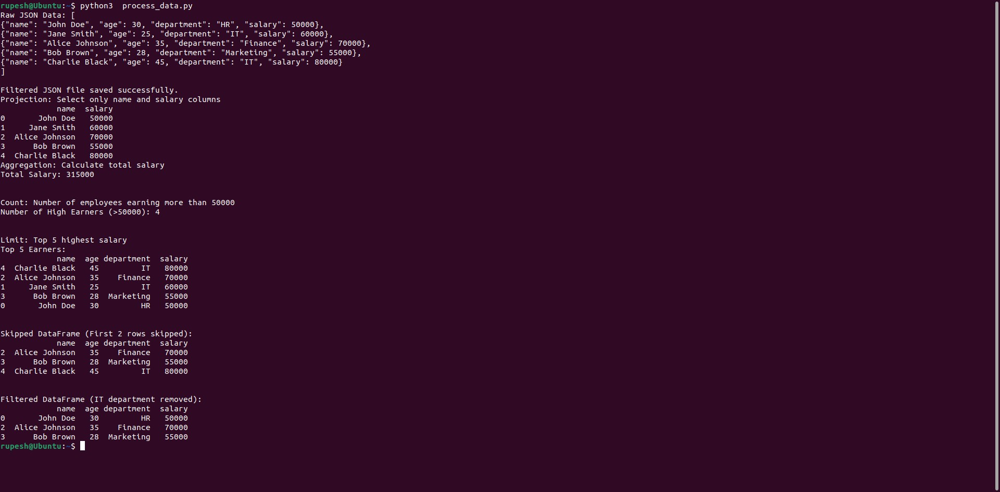

## Experiment 6: Manipulating JSON Data with jq

### AIM:

This guide demonstrates how to use the `jq` tool to perform various operations on JSON data, including projection, aggregation, removal, counting, limiting, skipping, and sorting.

### Procedure:

**Step 1: Create a JSON File**

Create a JSON file named `employees.json` and add the following data:

```json
[
  {
    "id": 1,
    "name": "Alice Johnson",
    "department": "Engineering",
    "age": 29,
    "salary": 70000
  },
  {
    "id": 2,
    "name": "Bob Smith",
    "department": "Marketing",
    "age": 35,
    "salary": 55000
  },
  {
    "id": 3,
    "name": "Charlie Davis",
    "department": "Engineering",
    "age": 25,
    "salary": 60000
  },
  {
    "id": 4,
    "name": "Dana Lee",
    "department": "Human Resources",
    "age": 40,
    "salary": 65000
  },
  {
    "id": 5,
    "name": "Eve Martinez",
    "department": "Finance",
    "age": 45,
    "salary": 75000
  }
]
```

**Step 2: Load and View the JSON Data**

Open a terminal or command prompt, navigate to the directory where `employees.json` is located, and use `jq` to load and view the JSON data:

```bash
jq . employees.json
```

This will display the entire JSON content in a formatted way.

**Step 3: Perform Operations**

Here are some examples of how to use `jq` to perform various operations on the JSON data:

**I. Projection:**

* **Extract specific fields:**
  ```bash
  jq '.[] | {name, department}' employees.json
  ```
* **Extract nested fields:**
  ```bash
  jq '.[] | .address.city' employees.json
  ```

**II. Aggregation:**

* **Calculate the average salary:**
  ```bash
  jq '.[] | .salary' employees.json | jq 'add'
  ```
* **Find the maximum salary:**
  ```bash
  jq '.[] | .salary' employees.json | jq 'max'
  ```

**III. Count:**

* **Count the number of employees:**
  ```bash
  jq '.[] | .name' employees.json | jq 'length'
  ```

**IV. Removal:**

* **Remove the "age" field:**
  ```bash
  jq '.[] | del(.age)' employees.json
  ```

**V. Limit:**

* **Limit the results to the first two employees:**
  ```bash
  jq '.[:2]' employees.json
  ```

**VI. Skip:**

* **Skip the first two employees:**
  ```bash
  jq '.[2:]' employees.json
  ```

**VII. Sort:**

* **Sort by name in ascending order:**
  ```bash
  jq '.[] | sort_by(.name)' employees.json
  ```
* **Sort by salary in descending order:**
  ```bash
  jq '.[] | sort_by(.salary) | reverse' employees.json
  ```

