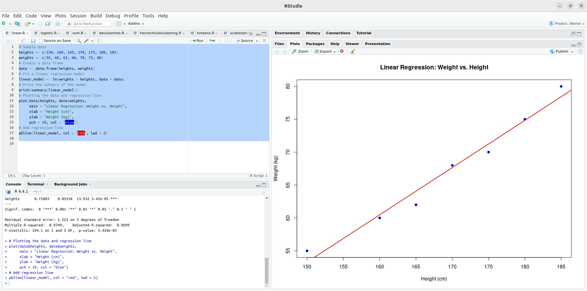

## Experiment 7: Implementing Linear and Logistic Regression in R

### AIM:

This guide demonstrates how to implement linear and logistic regression models in R, including data loading, preprocessing, model training, prediction, and evaluation.

### Procedure:

**1. Load Data:**

```R
# Sample data for linear regression
heights <- c(150, 160, 165, 170, 175, 180, 185)
weights <- c(55, 60, 62, 68, 70, 75, 80)

# Create a data frame
data <- data.frame(heights, weights)

# Load the mtcars dataset for logistic regression
data(mtcars)
```

**2. Data Preprocessing (Optional):**

- **Handle missing values:** Use techniques like imputation or removal.
- **Encode categorical variables:** Convert categorical data into numerical representations.
- **Normalize or standardize features:** Scale features to a common range to improve model performance.

**3. Split Data into Training and Testing Sets:**

```R
library(caTools)

set.seed(123)
split <- sample.split(data$weights, SplitRatio = 0.7)
train_data <- subset(data, split == TRUE)
test_data <- subset(data, split == FALSE)
```

**4. Choose Model and Train:**

**Linear Regression:**

```R
linear_model <- lm(weights ~ heights, data = train_data)
```

**Logistic Regression:**

```R
# Convert categorical variable to factor
mtcars$am <- factor(mtcars$am, levels = c(0, 1), labels = c("Automatic", "Manual"))

logistic_model <- glm(am ~ mpg, data = mtcars, family = binomial)
```

**5. Make Predictions:**

```R
# Linear Regression
predicted_weights <- predict(linear_model, newdata = test_data)

# Logistic Regression
predicted_probs <- predict(logistic_model, newdata = test_data, type = "response")
```

**6. Evaluate Model:**

**Linear Regression:**

```R
mse <- mean((test_data$weights - predicted_weights)^2)
print(paste("Mean Squared Error:", mse))
```

**Logistic Regression:**

```R
predicted_classes <- ifelse(predicted_probs > 0.5, 1, 0)
accuracy <- mean(predicted_classes == test_data$am)
print(paste("Accuracy:", accuracy))
```

**7. Visualize Results:**

**Linear Regression:**

```R
plot(train_data$heights, train_data$weights,
     main = "Linear Regression: Weight vs. Height",
     xlab = "Height (cm)",
     ylab = "Weight (kg)",
     pch = 19, col = "blue")
abline(linear_model, col = "red", lwd = 2)
```


**Logistic Regression:**

```R
plot(mtcars$mpg, as.numeric(mtcars$am) - 1,
     main = "Logistic Regression: Transmission vs. MPG",
     xlab = "Miles Per Gallon (mpg)",
     ylab = "Probability of Manual Transmission",
     pch = 19, col = "blue")
curve(predict(logistic_model, data.frame(mpg = x), type = "response"),
      add = TRUE, col = "red", lwd = 2)
```


**8. Fine-Tune Model:**

- **Adjust hyperparameters:** Explore different values for parameters like learning rate or regularization strength.
- **Apply regularization:** Techniques like L1 or L2 regularization can help prevent overfitting.
