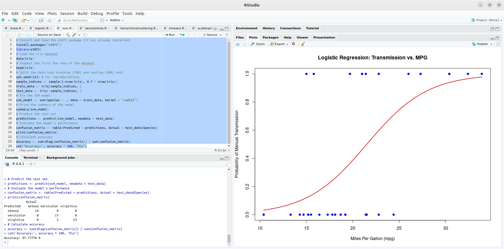
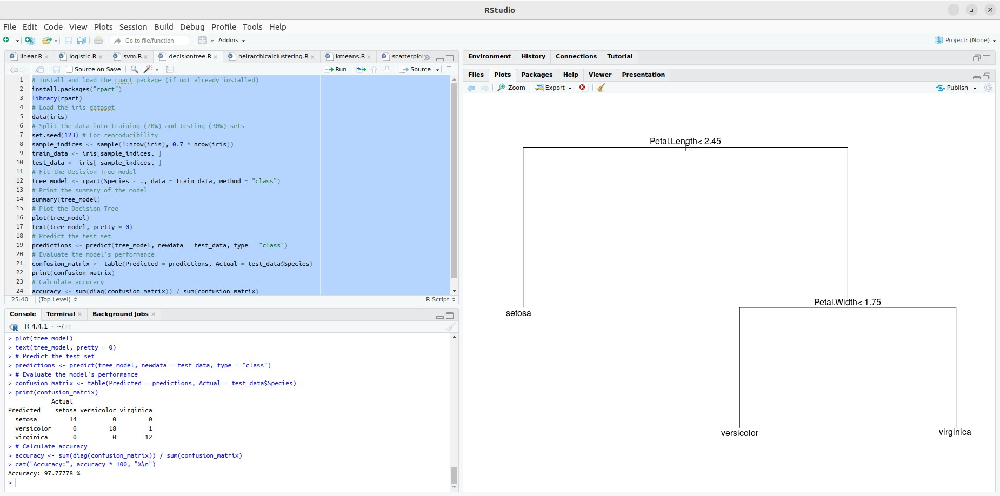

## Experiment 8: Implementing SVM and Decision Tree Classification in R

### AIM:

This guide demonstrates how to implement Support Vector Machine (SVM) and Decision Tree classification models in R, including data loading, preprocessing, model training, prediction, and evaluation.

### Procedure:

**1. Load Data:**

```R
# Load the iris dataset
data(iris)
```

**2. Data Preprocessing (Optional):**

- **Handle missing values:** Use techniques like imputation or removal.
- **Encode categorical variables:** Convert categorical data into numerical representations.
- **Normalize or standardize features:** Scale features to a common range, especially for SVM.

**3. Split Data into Training and Testing Sets:**

```R
library(caTools)

set.seed(123)
sample_indices <- sample(1:nrow(iris), 0.7 * nrow(iris))
train_data <- iris[sample_indices, ]
test_data <- iris[-sample_indices, ]
```

**4. Choose Model and Train:**

**SVM:**

```R
library(e1071)

svm_model <- svm(Species ~ ., data = train_data, kernel = "radial")
```

**Decision Tree:**

```R
library(rpart)

tree_model <- rpart(Species ~ ., data = train_data, method = "class")
```

**5. Make Predictions:**

```R
svm_predictions <- predict(svm_model, newdata = test_data)
tree_predictions <- predict(tree_model, newdata = test_data, type = "class")
```

**6. Evaluate Model:**

```R
# Calculate confusion matrix
svm_confusion_matrix <- table(Predicted = svm_predictions, Actual = test_data$Species)
tree_confusion_matrix <- table(Predicted = tree_predictions, Actual = test_data$Species)

# Calculate accuracy
svm_accuracy <- sum(diag(svm_confusion_matrix)) / sum(svm_confusion_matrix)
tree_accuracy <- sum(diag(tree_confusion_matrix)) / sum(tree_confusion_matrix)

# Print results
cat("SVM Accuracy:", svm_accuracy * 100, "%\n")
cat("Decision Tree Accuracy:", tree_accuracy * 100, "%\n")
```

**7. Visualize Results:**

**SVM (Decision Boundaries):**

```R
library(e1071)

plot(svm_model, data = train_data)
```


**Decision Tree:**

```R
plot(tree_model)
text(tree_model, pretty = 0)
```


**8. Fine-Tune Model:**

- **SVM:** Experiment with different kernels (linear, polynomial, radial) and the `C` hyperparameter.
- **Decision Tree:** Adjust `max_depth`, `minsplit`, `minbucket`, and other parameters to control the tree's complexity.
