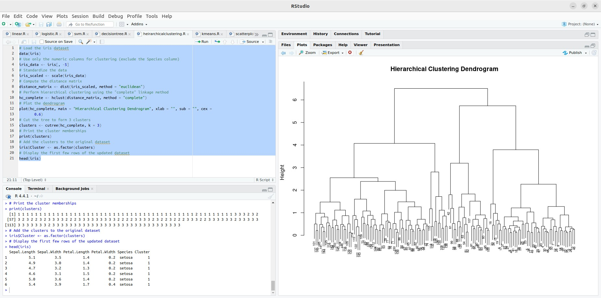
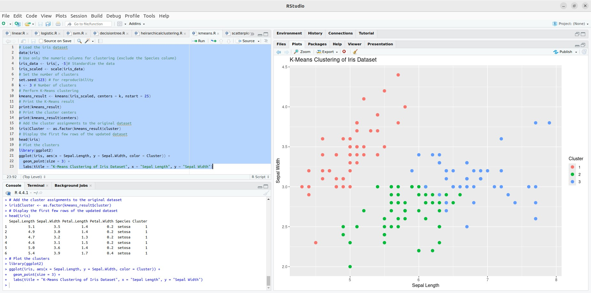

## Experiment 9: Implementing Hierarchical and K-Means Clustering in R

### AIM:

This guide demonstrates how to implement hierarchical and K-Means clustering algorithms in R, including data loading, preprocessing, model training, visualization, and evaluation.

### Procedure:

**1. Load Data:**

```R
# Load the iris dataset
data(iris)
```

**2. Data Preprocessing:**

* **Handle missing values:** Use techniques like imputation or removal.
* **Scale features:** Standardize or normalize features to ensure consistent scaling.

```R
# Use only the numeric columns for clustering (exclude the Species column)
iris_data <- iris[, -5]

# Standardize the data
iris_scaled <- scale(iris_data)
```

**3. Determine Number of Clusters (K-Means):**

Use techniques like the elbow method or silhouette analysis to estimate the optimal number of clusters.

**4. Choose Clustering Algorithm:**

* **Hierarchical Clustering:** Suitable for exploratory analysis and understanding hierarchical relationships.
* **K-Means Clustering:** Efficient for large datasets but requires specifying the number of clusters beforehand.

**5. Apply Hierarchical Clustering:**

```R
library(stats)

# Compute the distance matrix
distance_matrix <- dist(iris_scaled, method = "euclidean")

# Perform hierarchical clustering using the "complete" linkage method
hc_complete <- hclust(distance_matrix, method = "complete")

# Plot the dendrogram
plot(hc_complete, main = "Hierarchical Clustering Dendrogram", xlab = "", sub = "", cex = 0.6)

# Cut the tree to form 3 clusters
clusters <- cutree(hc_complete, k = 3)
```

**6. Apply K-Means Clustering:**

```R
library(stats)

# Set the number of clusters
set.seed(123)
k <- 3

# Perform K-Means clustering
kmeans_result <- kmeans(iris_scaled, centers = k, nstart = 25)
```

**7. Visualize Clusters:**

**Hierarchical Clustering:**

* The dendrogram generated in step 5 provides a visual representation of the clusters.



**K-Means Clustering:**

```R
library(ggplot2)

ggplot(iris, aes(x = Sepal.Length, y = Sepal.Width, color = Cluster)) +
  geom_point(size = 3) +
  labs(title = "K-Means Clustering of Iris Dataset", x = "Sepal Length", y = "Sepal Width")
```

**8. Evaluate Clustering Performance:**

* **Silhouette score:** Measures how similar a data point is to its own cluster compared to other clusters.
* **Inertia (for K-Means):** Measures the sum of squared distances between data points and their assigned cluster centers.

**9. Fine-Tune Clustering:**

* **Hierarchical Clustering:** Experiment with different linkage methods (single, complete, average, centroid).
* **K-Means Clustering:** Adjust the number of clusters and the `nstart` parameter.


